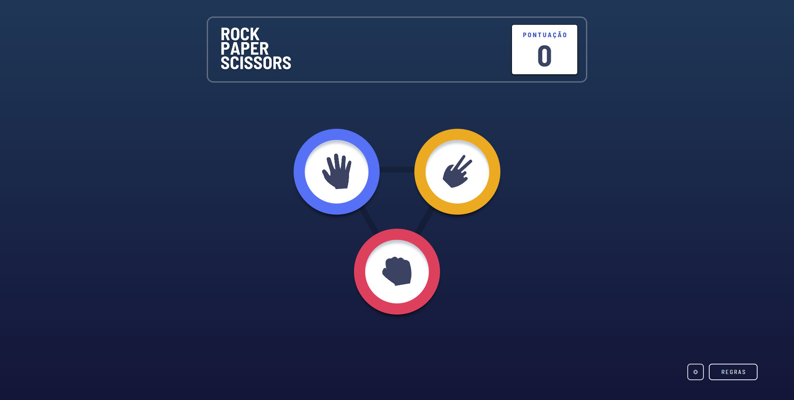

# Frontend Mentor - Rock, Paper, Scissors solution

This is a solution to the [Rock, Paper, Scissors challenge on Frontend Mentor](https://www.frontendmentor.io/challenges/rock-paper-scissors-game-pTgwgvgH). Frontend Mentor challenges help you improve your coding skills by building realistic projects.

## Table of contents

- [Overview](#overview)
  - [The challenge](#the-challenge)
  - [Screenshot](#screenshot)
  - [Links](#links)
- [My process](#my-process)
  - [Built with](#built-with)
  - [What I learned](#what-i-learned)
  - [Continued development](#continued-development)
- [Author](#author)

## Overview

### The challenge

Users should be able to:

- View the optimal layout for the game depending on their device's screen size
- Play Rock, Paper, Scissors against the computer
- Maintain the state of the score after refreshing the browser _(optional)_
- **Bonus**: Play Rock, Paper, Scissors, Lizard, Spock against the computer _(optional)_

**Extras**:

- Play against player local
- Settings button with language settings, if you want to play with a friend and modes
- Multiple translations
- Automatic translation by ip

### Screenshot



### Links

- Solution URL: [Here](https://github.com/DavidSntdev/rps-game)
- Live Site URL: [Here](https://davidsntdev.github.io/rps-game/)

## My process

### Built with

- Semantic HTML5 markup
- CSS custom properties
- Flexbox
- CSS Grid
- Mobile-first workflow
- Typescript
- [React](https://reactjs.org/) - JS library
- [Vite.dev](https://vitejs.dev/) - React framework
- [Tailwind CSS](https://tailwindcss.com) - For styles
- [nextUI](https://nextui.org/) - For UI
- [FramerMotion](https://www.framer.com/motion/) - For Animations

### What I learned

I learned to use frame motion, as in the example:

```tsx
<motion.img
  src={iconJ1}
  alt={`Escolha ${escolhaJ1}`}
  className="transition-opacity duration-1000 lg:w-[72px]"
  initial={{ scale: 0.5 }}
  animate={{ scale: 1 }}
  transition={{ duration: 0.8 }}
/>
```

### Continued development

I'm going to design a website that's usable, like one for a car dealership

## Author

- Website - [davidsntdev](https://davidsntdev.github.io/sites/)
- Frontend Mentor - [@dvd1337](https://www.frontendmentor.io/profile/dvd1337)
- Twitter - [@DillNTC](https://www.twitter.com/DillNTC)
